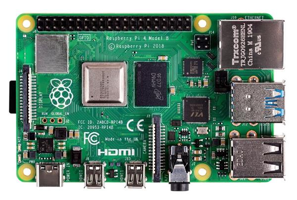

<!-- JS use if these pages are used as githubpages. can be deleted if used elsewhere -->

# Introduktion til Teknologifaget og til emnet Computer Arkitektur 

## Læringsmål

### For dette semester
Læringsmålene for dette fag på dette semester kan i sin generelle form findes i [Studieordningen](https://kea.dk/images/DA/Files/Uddannelser/Studieordninger/STO-Datamatiker-2019-december.pdf) på side 9.    
Læringsmålene er det i kan forvente at have lært efter dette semester er ovre, og det er hvad i vil blive bedømt ud fra til eksamenen i hvor høj grad i mestre disse læringsmål.

For at i kan opnå disse læringsmål skal vi i praksis igennem følgende discipliner:
#### Computer Arkitektur
* Kunne Identificere Hardware i en computer
	* CPU, RAM, SSD etc.
* Kunne forklare hvert enkel komponents funktion.

#### Operativsystemer og Unix File System
* Kunne forklare hvordan et OS overordnedet er opbygget og hvad et operativsystems funktioner er.
* Gøre brug af CLI til at navigere på jeres computer.

#### Operativsstemer - Webserver (obligatorisk opgave)
* Installation og konfiguration af en Apache Tomcat Server (Lokalt)
* Deploye en Web ARchive fil (WAR) på denne server.
* Deploye et statisk website (html, Css, JavaScript) på denne server.

#### Client / Server arkitektur
* Forstå Clientens og serverens ansvarsområder
* Basal forståelse for Http Protokollen
* Forståelse for GETmapping & POSTmapping i en Spring Boot Applikation

#### Databaser
* Installation af en Database Management Server
* Installation af en GUI til nem interaktion med Databaserne
* Hvad er en Database?
	* Hvad er forskelle og ligheder med en textfil?

#### Cloud Computing
* Hvad er Cloud computing
* Virtualisering
* Linux Styrresystem
* MySql Database
* WebServer
* IaaS, PaaS, SaaS
* Ondemand, Scalarbillity, Elasticity
* AWS - Amazon Web Services
	* Deploy webapp til denne udbyder
* Gennemgang af forskellig måder at deploye på

#### Tråde
* Hvordan får vi en computer til at arbejde effectivt og lave flere ting på en gang?

### Læringsmål for i dag
* Overblik over dette semesters indhold  og semesterets læringsmål.
* Identificere en computers hardwarekomponenter og kunne forklare hvad deres funktion er.
 
## Læringsforløb
* Intro med Claus (Dette semester & Hardwareoplæg)
* Opdeling i grupper
	* Se video og læs artikkel under Materialer
	* Lav øvelserne
	* Claus vil hoppe ind og ud af jeres grupperum og give feedback

## Materiale
* [Everything You Need to Know About Computer Hardware](https://www.lifewire.com/computer-hardware-2625895)
* [How To Identify The Components Inside Your Computer](https://www.youtube.com/watch?v=yRmPTbGBqVI)

## Øvelser

### Navngiv komponenter
* Navngiv alle komponenter på en Raspberry PI 4 og deres størrelse, ydeevne etc. og beskriv deres funktionalitet.    

 

* Identificer herefter komponenterne på din egen computer og beskriv deres størrelse, ydeevne etc.  Gør dette ved enten at skille din computer ad med en skruetrækker eller ved at finde et billede online og herefter kigge på det. 

### Lav et program der informerer brugeren om componenterne i en computer 
* Lav et program (Java) der informerer brugeren om componenterne i en computer. Programmet skal være interaktivt.
