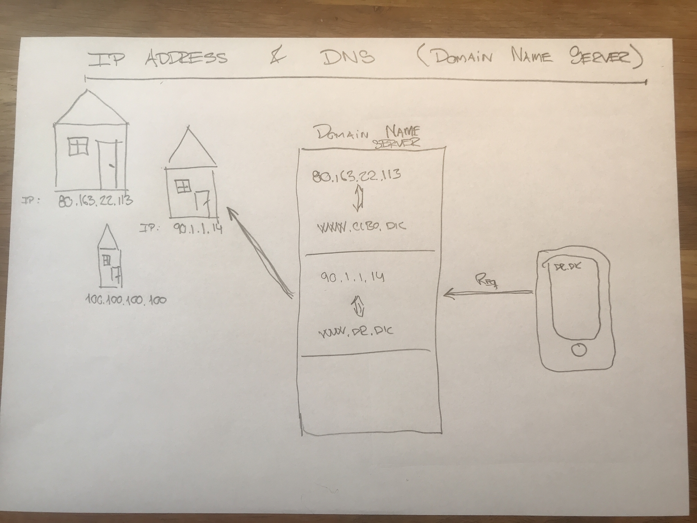
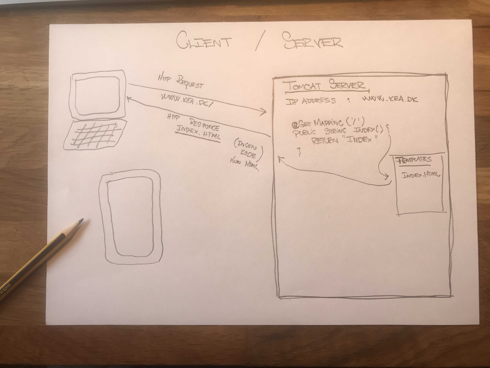
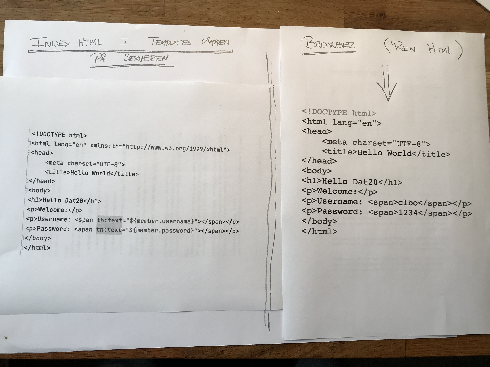

<!-- JS use if these pages are used as githubpages. can be deleted if used elsewhere -->

# Client / Server arkitektur 

## Læringsmål
* Du skal kunne beskrive Clientens (feks. browseren) og Serverens (feks. Tomcat) ansvarsområder. (Ex. hvor bliver koden i et konkret eksempel eksekveret)  
* Du skal have en basal forståelse af HTTP protokollen, herunder kunne forklare forskellen på GET og POST og vise hvordan i kan bruge det.
* Du skal forstå Request/Response i forhold til en Spring Boot Applikation.
* Du skal forstå og kunne bruge @GetMapping og @PostMapping i en Spring Boot Applikation. 
* Kunne bruge browserens inspect tool til at analysere en webapplikations request & responces. 

## Læringsforløb
* Introduktion og overblik ved Claus
* Studiegrupper
	* Lav øvelser og tutorials
* ca. 15.15 mødes vi samlet og laver opsamling, afrunding og snak.

## Materiale
* [i kan finde en løsning på 404 fejlen i forhold til jeres webserver opgave her](https://techkea.github.io/Dat-20-b-og-c-semesterplan/3.html#exporter-en-webapp-til-war)
* [Client–server model](https://en.wikipedia.org/wiki/Client%E2%80%93server_model)

### Ip Adresser og Domain Name Server

### Client / Server

### Hvad foregår på serveren og hvad foregår på klienten?

## Øvelser
### Et ultra simpelt spring boot projekt.
Lav et ultra simpelt spring boot projekt. Projektet minder meget om de i lige har fået demonstreret af Claus.    
1. Projektet skal ved oprettelsen bruge **"war packaging"**
2. Projektet skal have følgende dependencies:	
	* Web: Spring Web
	* Template engines: Thymeleaf
3. Lav en controller package med en klasse i som hedder HomeController
	* lav en index metode som returnerer en index.html side
4. Kør projektet og åben det via http://localhost:8080
5. Fra din mobiltelefon prøv om du kan se siden som kommer fra din computer. (Computer er serveren mobilen er clienten).
6. Forklar (for din gruppe, eller dig selv) flowet (step by step) fra at du skriver 192.168.0.16:8080 (eller en anden adresse) til at du får et http respoce tilbage fra serveren.

