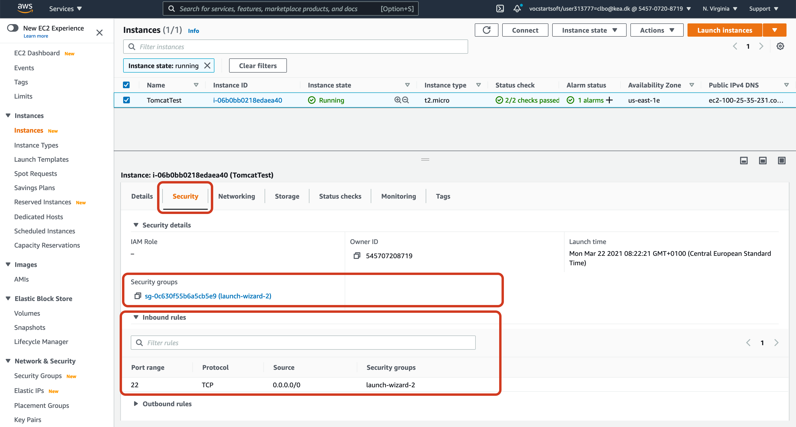
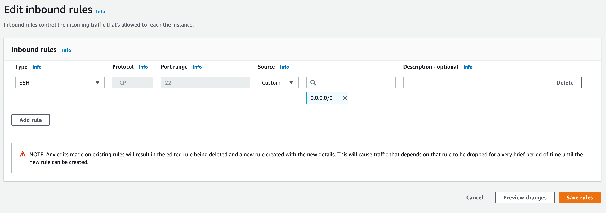
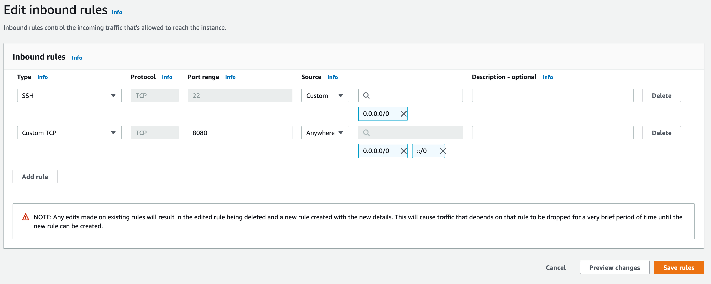

<!-- JS use if these pages are used as githubpages. can be deleted if used elsewhere -->
<script src="https://code.jquery.com/jquery-3.2.1.min.js"></script>
<script src="script.js"></script>

# Security rules for EC2 instance

As default you have set up one entry point from the outside world to you EC2 instance when you created it.

You should therefor be able to access your ec2 instance through the terminal using the SSH connection type.    

```
	$ ssh -i "myFirtKey.pem" ec2-user@ec2-18-196-109-146.eu-central-1.compute.amazonaws.com
```

This is at the moment the only access from the outside world you have. 

If you wnat to access you EC2 instance through the browser (or other ways), you need to open a port to your instance. Inyour case port 8080.    

## Create a new security rule

In you EC2 dashboard you have a **security tab**, with a **security groups link**, and a list of **inbound rules**.  



Click on **security groups** link, and the **Edit inbound rules** button .



Here you see the one rule (access) you have so fare. An SSH connection through port 22.    

Click on **Add new rule** and fil out the fields like this:



Click **Save rules**    


You are now able to access your tomcat server through:

```
	http://<public-ip>:8080
```
Be aware of the **http://** protocol and not the **https://**

    


